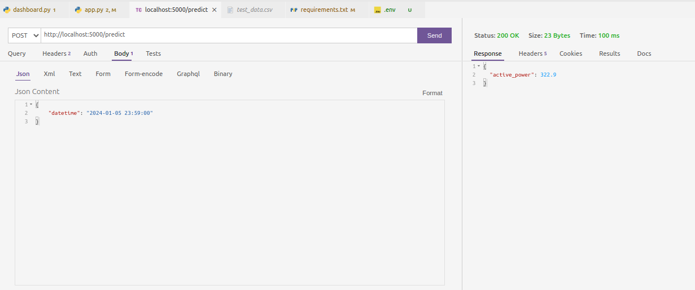

# 🔋✨ Energy Consumption Prediction Solution

This repository contains a solution for predicting household energy consumption based on historical data and weather information.

## 📚 Table of Contents

1. [📖 Project Overview](#project-overview)
2. [🔧 Prerequisites](#prerequisites)
3. [🚀 Quick Start](#quick-start)
4. [📡 API Usage](#api-usage)
5. [📊 Streamlit Dashboard](#streamlit-dashboard)
6. [🗂 Project Structure](#project-structure)
7. [🤝 Contributing](#contributing)

## 📖 Project Overview

This project aims to predict the next value of the "active_power" column in a dataset of household energy consumption. The solution includes:

- 📈 Data preprocessing and feature engineering
- 🧠 Model training and evaluation
- 📊 A Streamlit dashboard for data visualization and model insights
- 🐳 Containerized model deployment
- 🌐 A Flask API for serving predictions
- ☁️ Cloud infrastructure design suggestion
- ⚙️ Considerations for production-scale operationalization

## ☁️ Cloud Infrastructure Schema

Our proposed cloud infrastructure leverages AWS services to create a scalable, maintainable, and secure solution.

For a detailed diagram and explanation of the infrastructure, please refer to the [pdf](docs/Household_energy_consumption.pdf) file.

## 🔧 Prerequisites

- Python 
- TensorFlow
- Streamlit 
- Docker
- Flask

## 🚀 Setup and Installation

1. Clone this repository:

```bash
https://github.com/Ansem-chaieb/ve2max_assessment.git

cd ve2max_assessment
```

2. Build and run the Docker container:

```bash
docker build -t energy-consumption-prediction .

docker run -p 5000:5000 energy-consumption-prediction
```

## 📡 API Usage

Access the Flask API:
- Via web browser or curl: `http://localhost:5000`
- Using Postman: Import the provided Postman collection:

```json
{
    "datetime": "2024-01-05 23:59:00"
}
```

- Using Thunder Client VS Code extension: 
  1. Install the Thunder Client extension in VS Code
  2. Click on the Thunder Client icon in the sidebar
  3. Create a new request to `http://localhost:5000/predict`
  4. Set the method to POST and add the JSON body as shown:

**Note:** To run the Flask API, please ensure that you have the AWS credentials properly configured in the `.env` file. If you wish to execute the API, I will need to send you the necessary credentials beforehand.



## 📊 Streamlit Dashboard

The Streamlit dashboard provides interactive visualizations of the dataset and model performance. It includes:

Access the Streamlit dashboard (EDA and model result) at:
https://householdenergyconsumption.streamlit.app/


## 🗂 Project Structure

```
energy-consumption-prediction/
├── src/
│   ├── dataset.py        # Manages data loading, preprocessing, and train test split
│   ├── features.py       # Responsible for feature engineering and processing
│   ├── dashboard.py      # Contains code for creating the Streamlit dashboard
│   ├── plots.py          # Includes functions for generating various plots and visualizations
│   └── modeling/
│       ├── train.py      # Handles the training process 
│       └── predict.py    # Manages the prediction process using trained models
│
├── notebooks/
│   └── train_evaluate_models.ipynb    # Jupyter notebook for training and evaluating different models
├── docs/
│   └── Household_energy_consumption.pdf
├── Dockerfile
├── app.py                # Flask application
├── requirements.txt
└── README.md
```

## 🤝 Contributing Members

**Data Scientist: [Ansem Chaieb](mailto:ansem.cb@gmail.com)**